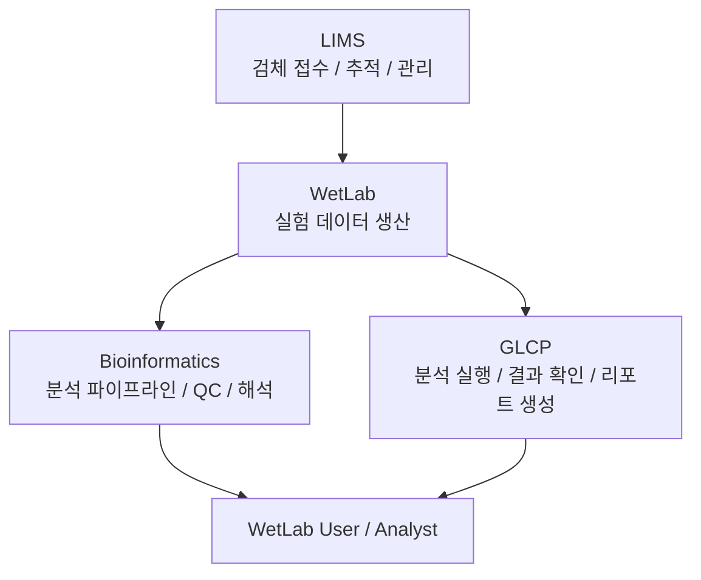

## 🧬 Overview

BI Platform 팀은 유전자검사실 운영에 필요한 유전체 데이터 분석 및 전산 시스템을 개발하고 운영하는 조직입니다.
우리는 WetLab에서 생산되는 다양한 유전체 데이터를 기반으로, 데이터 처리부터 분석, 결과 생성 및 리포팅까지 전 과정을 지원하는 통합 플랫폼을 구축합니다.
Bioinformatics, IT Platform 2개 파트가 유기적으로 협력하여, 검사 품질과 효율성을 동시에 확보하는 것을 목표로 합니다.

## 🔄 VISION

WetLab에서 생성된 데이터는 Bioinformatics 분석을 거쳐, GLCP 플랫폼을 통해 사용자에게 전달됩니다.
이 과정은 LIMS를 통해 검체 단위로 추적 및 관리되며, 전체 workflow의 일관성과 신뢰성을 보장합니다.



## 🔬 Core Focus

### 🧪 Bioinformatics

WetLab에서 생산된 데이터를 입력으로 받아, 검사 목적에 맞는 분석을 수행하고 결과를 도출하는 분석 소프트웨어, 파이프라인 및 모듈을 개발·운영합니다.

* NGS / Array 데이터 처리 및 분석
* Variant detection 및 interpretation
* QC 및 validation 로직 구현
* 분석 reproducibility 및 version 관리


### 🖥 IT (LIMS)

유전자검사실로 입수되는 검체의 접수 및 관리 전반을 담당하며, 공인 인증 기준에 부합하는 시스템을 개발 및 유지보수합니다.

* LIMS 기반 검체 접수 및 추적 관리
* 검사 workflow 관리
* 데이터 무결성 및 보안 유지
* 인증 및 규정 대응 시스템 운영


### 🚀 Platform (GLCP)

GenoLifeCare Platform (GLCP)을 개발 및 제공하여, WetLab 실험자가 직접 데이터를 분석하고 결과 리포트를 생성할 수 있는 환경을 제공합니다.

* 사용자 중심 분석 플랫폼 개발
* 분석 소프트웨어 연동 및 실행
* 결과 시각화 및 리포트 생성
* End-to-end 분석 환경 제공


---

## ⚙️ Development Workflow

모든 코드는 다음 절차를 따릅니다:

1. Feature branch 생성
2. Pull Request 생성
3. Code Review 진행
4. 승인 후 main branch merge

```bash
git checkout -b feature/your-feature
git push origin feature/your-feature
```

---

## 🛡 Branch Policy

- `main` branch 직접 push 금지
- Pull Request 필수
- 최소 1명 이상 리뷰 승인 필요

---

## 🧪 Bioinformatics Standards

- Pipeline version 관리 필수
- 분석 reproducibility 보장
- QC 기준 문서화 및 자동화
- Reference genome 및 DB version 명시

---

## 📚 Documentation

- 각 repository의 README 참고
- 향후 Wiki / Docs 페이지 확장 예정

---

## 👥 Team

BI Platform Team
- @seungil.yoo
- @geunhan.jung
- @boram.choi
- @byungjo.kim

---

## 🤝 Contribution

- Issue 등록 후 작업 진행 권장
- PR 기반 협업 필수
- 명확한 commit message 작성

---

## 📌 Notes

- 본 조직의 repository는 내부 연구 및 서비스 목적입니다.
- 외부 공개 시 별도 검토가 필요합니다.

---

## 📬 Contact

문의 및 협업 요청은 팀 담당자에게 연락 바랍니다.
